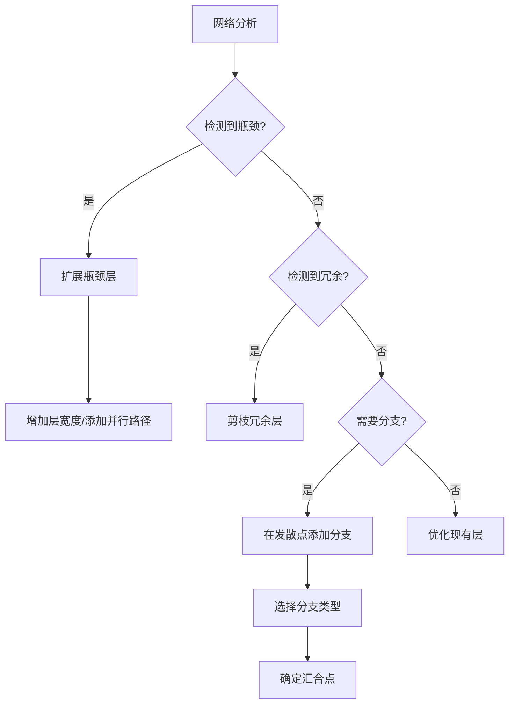

# 信息论指导的架构演化系统

## 概述

根据您的建议，我们实现了一个完全基于信息论原理的架构演化系统。该系统使用信息论来指导所有架构决策：

- **在哪里添加层**：基于信息瓶颈分析
- **添加多少层**：基于信息容量需求
- **层的大小**：基于互信息分析
- **是否添加分支**：基于信息流发散度
- **分支点和汇合点**：基于信息流分析
- **删除哪些层**：基于层重要性和冗余度

## 核心原理

### 1. 信息瓶颈检测

系统通过计算每层的信息瓶颈分数来识别网络中的瓶颈：

```python
bottleneck_score = info_reduction * (1 - capacity)
```

其中：
- `info_reduction = 1 - I(layer_output; final_output) / I(input; layer_output)`
- `capacity` 基于层输出的有效秩（通过SVD计算）

### 2. 层重要性评估

使用公式 `I(L_i;O) = H(O) - H(O|L_i) · ψ(TaskType)` 计算每层的重要性：

- `H(O)` - 输出熵
- `H(O|L_i)` - 给定层输出的条件熵
- `ψ(TaskType)` - 任务相关权重

### 3. 信息发散度分析

通过分析层输出中不同通道/特征之间的互信息来确定是否需要分支：

- 对于卷积层：计算通道间的成对互信息
- 对于全连接层：使用基于熵的发散度
- 低互信息表示高发散度，适合创建分支

### 4. 冗余度检测

通过计算相邻层之间的互信息来检测冗余层：

```python
redundancy = mean(MI(layer, predecessors) + MI(layer, successors))
```

## 系统架构

### InformationGuidedEvolution 类

主要的分析和决策引擎，提供以下功能：

1. **analyze_network()**：对网络进行全面的信息论分析
2. **decide_evolution_action()**：基于分析结果决定演化动作
3. **_identify_bottlenecks()**：识别信息瓶颈
4. **_identify_redundant_layers()**：识别冗余层
5. **_identify_branch_points()**：识别最佳分支点

### DynamicArchitecture 类

支持运行时架构修改的包装器：

1. **DynamicBlock**：可以有多个并行分支的动态块
2. **add_branch_to_layer()**：向特定层添加分支
3. **expand_layer()**：扩展层的容量
4. **remove_layer()**：删除冗余层

### 分支类型

系统根据信息发散度选择不同的分支类型：

1. **高发散度（>0.8）**：
   - 空间注意力分支
   - 通道注意力分支
   - 特征提取分支

2. **中等发散度（0.6-0.8）**：
   - 局部特征分支
   - 全局特征分支

3. **低发散度（<0.6）**：
   - 简单的并行卷积路径

## 使用方法

### 1. 基本使用

```python
# 创建 NeuroExapt 实例时自动启用信息论指导
neuro_exapt = NeuroExapt(
    task_type="classification",
    device=device,
    verbose=True
)

# 在演化时传入样本数据
sample_data = next(iter(train_loader))[0].to(device)
evolved, info = neuro_exapt.evolve_structure(
    performance_metrics,
    sample_data=sample_data  # 关键：传入样本数据
)
```

### 2. 自定义阈值

```python
# 初始化时自定义阈值
neuro_exapt.info_guided_evolution = InformationGuidedEvolution(
    info_theory=neuro_exapt.info_theory,
    entropy_ctrl=neuro_exapt.entropy_ctrl,
    device=device,
    min_importance_threshold=0.1,      # 最小层重要性
    max_redundancy_threshold=0.7,      # 最大冗余度
    bottleneck_threshold=0.3,          # 瓶颈检测阈值
    divergence_threshold=0.5           # 分支创建阈值
)
```

### 3. 分析网络信息流

```python
# 获取详细的信息流分析
analysis = neuro_exapt.info_guided_evolution.analyze_network(
    model,
    sample_data
)

# 查看分析结果
print("信息瓶颈：", analysis['bottlenecks'])
print("冗余层：", analysis['redundant_layers'])
print("潜在分支点：", analysis['branch_points'])
print("信息流指标：", analysis['info_flow'])
```

## 演化决策流程



## 实际效果

### 1. 自动瓶颈解决

当检测到信息瓶颈时，系统会：
- 计算所需的信息容量
- 选择合适的扩展方式（增加宽度或添加并行路径）
- 保留原有权重，确保训练连续性

### 2. 智能分支创建

系统会：
- 在信息发散的位置创建专门化分支
- 根据发散类型选择合适的分支架构
- 自动确定最佳汇合点以最小化信息损失

### 3. 冗余消除

系统会：
- 识别对最终输出贡献小的层
- 检查删除是否安全（不会断开信息流）
- 逐步减少冗余层的影响

## 监控和调试

### 1. 信息流可视化

```python
# 获取层级信息指标
for layer_name, layer_info in analysis['layer_info'].items():
    print(f"{layer_name}:")
    print(f"  互信息(输入): {layer_info.mutual_info_input:.3f}")
    print(f"  互信息(输出): {layer_info.mutual_info_output:.3f}")
    print(f"  重要性: {layer_info.importance:.3f}")
    print(f"  瓶颈分数: {layer_info.bottleneck_score:.3f}")
    print(f"  冗余度: {layer_info.redundancy:.3f}")
```

### 2. 演化历史跟踪

```python
# 查看演化决策
if evolved:
    print(f"演化动作: {info['action']}")
    print(f"原因: 基于信息论分析")
    print(f"详细信息: {info}")
```

## 高级特性

### 1. 任务感知优化

系统会根据任务类型调整决策：
- 分类任务：重视层重要性
- 生成任务：重视信息保留
- 回归任务：平衡考虑

### 2. 自适应阈值

阈值可以根据训练进展自动调整：
- 训练初期：更宽松的阈值，允许更多探索
- 训练后期：更严格的阈值，专注于优化

### 3. 多尺度分析

系统在多个尺度上分析信息流：
- 局部：单层的信息处理
- 区域：相邻层之间的信息传递
- 全局：整个网络的信息流

## 总结

这个信息论指导的架构演化系统实现了您的愿景：让信息论来决定所有的架构变化。系统不再依赖于简单的规则或启发式方法，而是基于严格的信息论分析来做出每个决策。

主要优势：
1. **理论基础扎实**：所有决策都有信息论支撑
2. **自适应性强**：根据实际信息流动态调整
3. **智能化程度高**：能够识别复杂的信息模式
4. **可解释性好**：每个决策都有明确的信息论依据

这使得网络能够自动发现最优的架构，充分利用信息容量，同时避免冗余和瓶颈。 